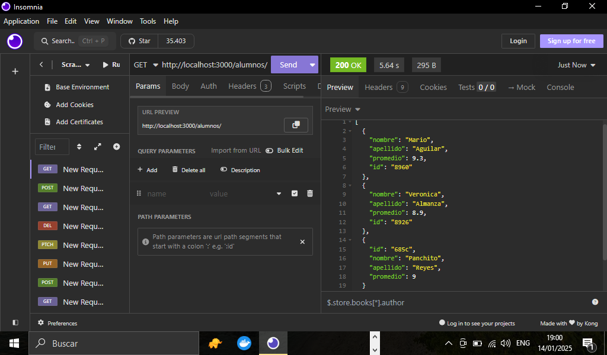

# TITULO DEL PROYECTO    

**Elaboración De Un Pequeño Servidor Con NodeJs Y Plasmamos Una Base De Datos En El**

# DESCRIPCIÓN DEL PROYECTO (Servidor Con NodeJs)
**En esta práctica elaboramos un pequeño servidor con NodeJs, donde contendrá como información una pequeña base de datos, donde se muestran profesores que imparten varias materias, así mismo información de algunos alumnos como su promedio, su nombre ,etc. y por ultimo las materias o tecnologías que se imparten, su duración del curso y su dificultad, esta práctica se hizo con la finalidad de entender cómo se estructura un Back-end, como funciona NodeJs, como podemos consumir dicha base de datos, como es que funcionan las API's, los diferentes métodos http que podemos encontrar a la hora de manejar peticiones http a las API y entender cómo se plasma la información de la base de datos en las API's hoy en día que es a través del formato JSON y por último que son los Endpoints y cómo es que funcionan en el desarrollo web Back-end(API's).A continuación explico más detalle los que se desarrolló en esta práctica**

## ESTRUCTURA JSON DE UNA BASE DE DATOS EN EL SERVIDOR
**Para comenzar a desarrollar esta práctica vamos hacer uso de un paquete npm de NodeJs que se llama json-server este nos va ayudar a ejecutar un servidor de Node nos brindara un puerto y una dirección url en este caso sera de manera local(localhost:3000), para que funcione este paquete debemos crear un archivo en formato json llamado db.json como se muestra en el archivo de este repositorio donde colocamos una serie de objetos que representan una pequeña base de datos donde colocamos primero a los profesores, alumnos y tecnologías cada una de estas tres entidades por así decirlo cuentas con sus campos por ejemplo en caso de profesores tiene un nombre, apellido y las materias que imparte y así con las demás entidades como se puede observar en el siguiente código json(db.json)**

```Json
    {
        "profesores": [
            {
                "nombre": "Sergie",
                "apellido": "Code",
                "materias": [
                    {
                        "nombre": "NodeJS desde cero"
                    },
                    {
                        "nombre": "ReactJS desde cero"
                    },
                    {
                        "nombre": "JavaScript desde cero"
                    }
                ],
                "id": "b87b"
            }
        ],
        "alumnos": [
            {
                "nombre": "Mario",
                "apellido": "Aguilar",
                "promedio": 9.3,
                "id": "8960"
            },
            {
                "nombre": "Verónica",
                "apellido": "Almanza",
                "promedio": 8.9,
                "id": "8926"
            },
            {
                "id": "685c",
                "nombre": "Panchito",
                "apellido": "Reyes",
                "promedio": 9
            }
        ],
        "tecnologías": [
            {
                "nombre": "NodeJS desde cero",
                "duración": 7,
                "dificultad": "intermedio",
                "id": "2c19"
            },
            {
                "nombre": "ReactJS desde cero",
                "duración": 8,
                "dificultad": "intermedio",
                "id": "2b07"
            },
            {
                "nombre": "Angular17 desde cero",
                "duración": 9,
                "dificultad": "alta",
                "id": "c596"
            }
        ]
    }
```

## MANEJO DEL PAQUETE NPM JSON-SERVER (Endpoints)
**Ya después de haber creado nuestra pequeña base de datos en formato json sin necesidad de colocarle el id ya que este paquete lo genera automáticamente cuando hacemos alguna petición es por eso que en el código anterior ya lo tiene colocado, aclarando esto lo que sigue es que el paquete nos genere la url de manera local y los diferentes Endpoint que prácticamente así se le conocen a las diferentes rutas que podemos encontrar en cualquier API ,que en este caso serán localhost:3000/profesores,localhost:3000/alumnos.localhost:3000/tecnologias, como puedes ver esto nos lo genera automáticamente este paquete dándonos las diferentes url de nuestra aplicación y el puerto 3000 donde esta ejecutándose el servidor, para generar todo esto hay que agregar la siguiente línea de código en nuestro archivo package.json de nuestro proyecto de NodeJs:**
```json
    // Esto nos permitirá que a la hora de ejecutar nuestro proyecto de node  con el comando npm start vaya y observe el archivo db.json que es la base de datos en formato json que habíamos creado primero 
    "scripts": {
        "start": "json-server --watch db.json"
    },
```
## VISTA PREVIA DE NUESTRO SERVIDOR NODEJS CORRIENDO(npm start)


## AHORA NUESTRA API CORRIENDO EN EL NAVEGADOR POR LOS DIFERENTES ENDPOINTS(Urls de la aplicación):
+ localhost:3000/profesores

+ localhost:3000/alumnos

+ localhost:3000/tecnologías


## MANEJO DE PETICIONES HTTP(METODOS HTTP)
**Para finalizar vamos a consumir este pequeño back-end que hicimos, para ello vamos a utilizar un cliente en esta caso utilizaremos la herramienta Insomnia que es para probar los diferentes métodos http más utilizados a la hora de consumir una API**
## METODOS HTTP MAS UTILIZADOS
+ GET (NOS TRAE TODA LA INFORMACION)
+ GET(ID) (NOS TRAE UN ELEMENTO POR SU ID)
+ POST (NOS PERMITE AGREGAR UN ELEMENTO)
+ PUT (ACTUALIZA UN REGISTRO YA CREADO)
+ PATCH (ACTUALIZA UN REGISTRO PERO DE FORMA PARCIAL)
+ DELETE (ELIMINA UN REGISTRO)

## CONSUMIENDO LA API CON INSOMNIA
**Ahora vamos a probar todos los métodos mencionados anteriormente vamos a usar Insomnia que es un software que nos permite probar el funcionamiento de estos métodos a la hora de consumir un Back-end y ver la información que nos trae. A continuación los métodos HTTP**
## METODO GET(http://localhost:3000/profesores)
**Nos trae todos los profesores que están en la base de datos**
 

## METODO POST(http://localhost:3000/profesores)
**Agregamos a un nuevo profesor mandando la información un formato json**


## METODO GET POR ID(http://localhost:3000/tecnologìas/2b07)
**Usamos el método get por id para traernos una materia que en este caso son tecnologías por su id**


## METODO PUT(http://localhost:3000/profesores/:id)
**Aquí vamos a actualizar un registro en la prueba fue actualizar a un profesor por id y le agregamos otra materia mandando el id en la url**


## METODO PATCH(http://localhost:3000/profesores/:id)
**Con el método PATCH actualizamos de manera parcial un registro para la prueba fue cambiar el apellido al profesor también colocando el id en la url y mandando en el body solamente el campo que queremos actualizar**


## METODO DELETE(http://localhost:3000/profesores/:id)
**Método DELETE  lo aplicamos para borrar un registro en este caso fue eliminar a un profesor igual pasamos su id en la url y aplicamos el método**


## METODO GET EN LAS ENTIDADES TECNOLOGIAS Y ALUMNOS
**Todo está funcionando bien verificamos el método GET en las otras dos entidades y nos trae todos los alumnos y todas las materias que llamamos tecnologías en esta práctica**

+ Método GET(Tecnologías)


+ Método GET(Alumnos)


### Lista De Tecnologías, Propiedades De NodeJs y Herramientas Usadas En Nuestro Proyecto(Creando Un Servidor Con NodeJs)  

1. Lenguaje De Programación(JavaScript)
2. NodeJs v20.11.1 (Entorno De Ejecución)
3. Visual Studio Code(Editor De Código)
4. Manejo De Paquetes npm(json-server)
5. Manejo De Archivos Json(Formato De Las API's)
6. Implementación De Objetos(Base De Datos)
7. Configuración Para El Uso De json-server
8. Insomnia(Para Consumir La API)
9. Estructura De Un Back-end(NodeJs)
10. Métodos HTTP(GET,PUT,POST,DELETE Y PATCH)
11. Entpoints(urls De La API)
12. Github
13. Peticiones HTTP(Insomnia)

*Elaborado Por: Mario Martínez Aguilar*


